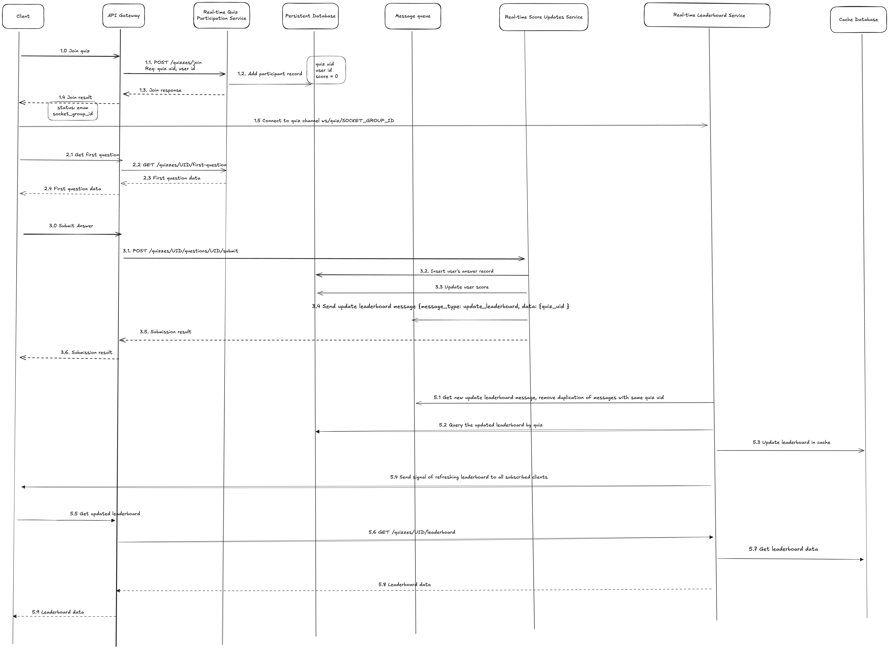

### System Design Document

The architecture is based on the following non-functional assumptions
 
- 1 million quiz
- 100 questions per quiz
- 100 users per quiz
- 4 answers per question

This is my draft table schemas
```
Quiz
UID (string 32)
32 * 1M = 32M bytes = 32MB
```

```
Question
Id (string 32)
quiz_uid (string 32)
Content (string 500)
100questions/quiz = 56400000000 bytes = 54 GB
```

```
Answer
Id (string 32)
question_id (string 32)
Content (String 255)
Is_correct (bool)
4 answers/question = 122 GB
```

```
Quiz score
quiz_uid (string 32)
user_uid (string 32)
Score (integer 4)
100 users/quiz = 6.5GB
```

#### Architecture Diagram

The architecture diagram below illustrates the components required for the Real-Time Quiz feature:


#### Component Descriptions

1. **Client**:
   - The client application is responsible for rendering the quiz interface and handling user interactions.
   - It communicates with the server to join a quiz session, submit answers, and receive real-time updates.
   - It uses WebSockets to receive real-time updates from the server.

2. **API Gateway**:
    - The API Gateway is the entry point for all client requests.
    - It routes requests to the appropriate microservices.
    - Load balancing and rate limiting can be implemented at this layer.

3. **User Participation Service**:
    - The User Participation Service manages quiz, quiz data (including question and answer, quiz/question metadata) and quiz participation.
    - It handles user participation in a quiz session including joining a quiz session and getting quiz data.
    - It provides some apis for client to get question/answer, join a quiz session

4. **Real-Time Score Updates Service**:
    - The Real-Time Score Updates service is responsible for updating user scores in real-time.
    - It provides an API endpoint for client to submit user answer then calculates scores. Need to be accurate and consistent.
    - The service then updates the user's score in the database and emits a `leaderboard update` event to the leaderboard service.

5. **Real-time Leaderboard Service**:
    - It listens for `leaderboard update` events and updates the leaderboard in real-time.
    - The leaderboard service retrieves the latest scores from the database and updates to cache for fast retrieval.
    - It provides an API endpoint for clients to fetch the latest leaderboard standings.

6. **Database**:
    - The database stores quiz data, user participation data, and leaderboard data.
    - It is used by the User Participation Service, Real-Time Score Updates Service and Real-time Leaderboard Service to store and retrieve data.

7. **Message queue**:
    - The message queue is used to decouple the User Participation Service, Real-Time Score Updates service, and Real-time Leaderboard Service.
    - It ensures that the services are loosely coupled and can scale independently.
    - It also provides fault tolerance by storing messages until they are processed.

8. **Cache**:
    - Cache is used to store the latest leaderboard standings for fast retrieval.
    - It reduces the load on the database and improves the performance of the leaderboard service.
    - It locks user score when updating to prevent duplicate score update, avoid locking on database row level.

#### Data Flow

The data flow in the Real-Time Quiz feature is as follows:



#### Technologies and Tools

1. **Client**:
   - **Technology**: Depends on the platform (Web, Mobile, Desktop).

2. **API Gateway**:
    - **Technology**: AWS API Gateway.
    - **Justification**: API Gateway provides a managed service for routing requests to microservices, handling authentication, load balancing, and rate limiting.

3. **User Participation Service**:
    - **Technology**: FastAPI. deploy on AWS Fargate
    - **Justification**: 
      - FastAPI is a high-performance web framework for building APIs, light-weight and fully support asynchronous. 
      - Deploying on AWS Lambda allows for auto-scaling and cost-effective serverless architecture when high traffic is expected.
      - By using AWS Fargate, don't need to manage servers or clusters. AWS handles the infrastructure provisioning and scaling automatically. And only pay for the resources usage

4. **Real-Time Score Updates Service**:
    - **Technology**: FastAPI. AWS Fargate
    - **Justification**: 
      - Consistency in technology stack with Real-time Leaderboard Service. Starlette is a lightweight ASGI framework that can handle high concurrency and is well-suited for real-time applications.

5. **Real-time Leaderboard Service**:
    - **Technology**: FastAPI, WebSocket, deploy on AWS Fargate.
    - **Justification**: 
      - Consistency in technology stack with User Participation Service and Real-Time Score Updates service. 
      - FastAPI is a high-performance web framework for building APIs, light-weight and fully support asynchronous. Deploying on AWS Lambda allows for auto-scaling and cost-effective serverless architecture when high traffic is expected.
      - WebSockets are used to provide real-time updates to clients.

6. **Database**:
    - **Technology**: AWS RDS (MySQL)
    - **Justification**: 
      - Quiz, leaderboard and user participation data are structured and relational, making MySQL a suitable choice.
      - Question and answer might be extended to include multimedia content, which can be stored in S3 and referenced in the database, so it still seems structured data. Then SQL database is a good choice.
      - When it comes to SQL db at the moment, the most 2 popular choices are MySQL and PostgreSQL. MySQL is chosen because it is easier to use and has better performance for write-heavy workloads than PostgreSQL (don't need to reindex all tables when adding new data/update data).

7. **Message Queue**:
    - **Technology**: Kafka
    - **Justification**: 
      - Kafka is a distributed streaming platform that can handle high throughput and low latency
      - Kafka consumer is pull-based, which allows services to consume messages at their own pace, and process multiple messages at once.

8. **Cache**:
    - **Technology**: Redis
    - **Justification**: 
      - Redis is an in-memory data store that can provide low-latency access to frequently accessed data.
      - It can store data with various types of structures
